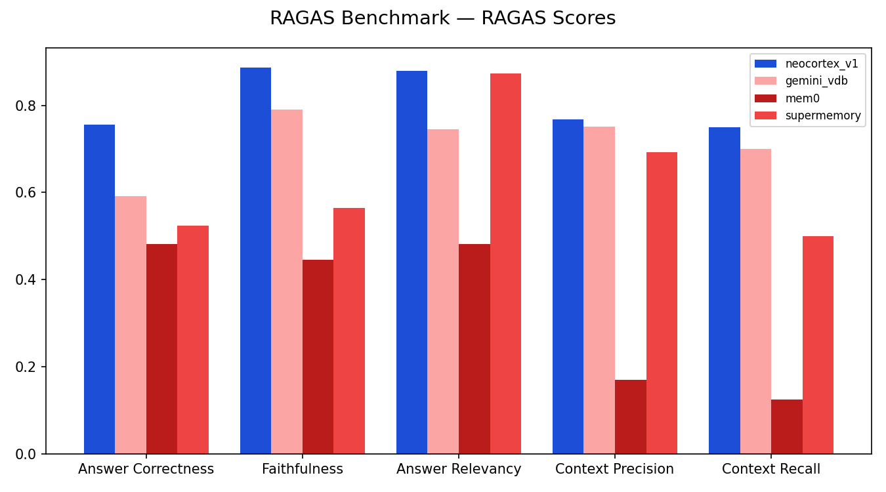
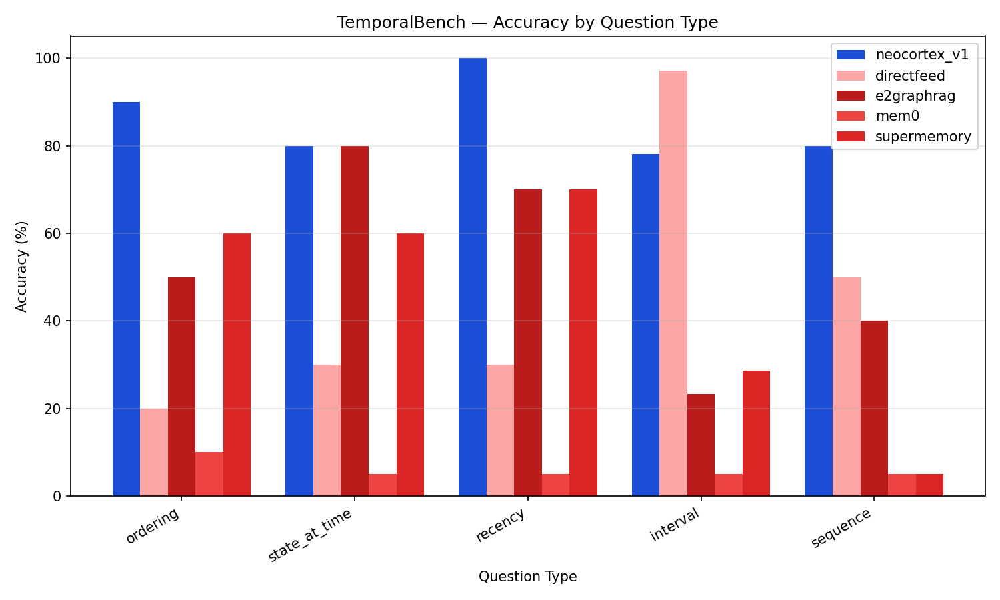

<div align="center">

<h1>TinyCortex 🧠 — Human-like AI Memory in Rust</h1>

**Forgets the noise ◦ Local-first & inspectable ◦ Markdown as source of truth ◦ Built in Rust**

[](https://crates.io/crates/tinycortex)
[](https://docs.rs/tinycortex)
[](./LICENSE)

[Discord](https://discord.tinyhumans.ai) • [Reddit](https://www.reddit.com/r/tinyhumansai/) • [X](https://x.com/tinyhumansai) • [Docs](https://tinyhumans.gitbook.io/tinycortex/)

#### [Benchmarks](#-benchmarks) • [Getting Started](#-getting-started) • [Architecture](https://tinyhumans.gitbook.io/tinycortex/) • [Read the paper](./paper/README.md)

</div>

The human brain is a master at compression. It doesn't try to remember every passing detail; instead it aggressively prunes noise to keep a sharp, focused, easily accessible recall of what truly matters. Traditional AI memory systems do the opposite — they try to remember _everything_ and retrieve whatever is _similar_. But similar doesn't mean important. The result? Your AI drowns in stale, irrelevant context that degrades every response.

**TinyCortex** takes the brain's approach: it **intelligently forgets noise**. A multi-signal admission gate drops low-value content at ingest. Retrieval provides semantic, keyword, graph, summary-tree, and freshness-scoring building blocks so hosts can choose an explicit ranking policy instead of treating every stored item as equally useful.

The hosted TinyCortex platform has been evaluated on [RAGAS](https://www.ragas.io/), TemporalBench, [BABILong](https://github.com/booydar/babilong/), and [Vending-Bench](https://andonlabs.com/evals/vending-bench-2) — see [Benchmarks](#-benchmarks) below for the reported results and what you can reproduce from this repo.

> **What this repository is:** the open-source **Rust core** of TinyCortex — the local-first memory engine — published on [crates.io](https://crates.io/crates/tinycortex) as [`tinycortex`](https://crates.io/crates/tinycortex). It is a _library_: you embed it in your own agent, service, or app. The hosted TinyCortex platform is currently in closed alpha — [reach out](mailto:founders@tinyhumans.ai) for access.

# 🎯 Core Features

## Intelligent Noise Filtering

Every chunk passes a multi-signal admission gate at ingest, so low-value content is dropped before it pollutes the store. The retrieval module exposes exponential freshness decay (7-day half-life by default) as a composable signal; built-in tree queries use semantic similarity or recency unless the host applies the hybrid composer.


## Interaction-Aware Scoring

Not all memories are equal. Authored messages, replies, DMs, and mentions all signal what matters, and each carries its own weight in the admission score. Knowledge people engage with rises to the top; ignored information fades away.


## Local-First & Inspectable

Markdown files are the source of truth. SQLite chunk rows, summary trees, vectors, and a git-backed change ledger (opt-in via the `git-diff` Cargo feature) are _derived_ indexes that accelerate reads and can be rebuilt from canonical content. Every item carries source provenance and a security `taint` (internal vs. external-sync).

## Recency-Weighted Recall

TinyCortex exposes keyword relevance, vector similarity, graph proximity, freshness, and an explainable hybrid-score composer. These are policy primitives rather than a hidden global ranking rule: hosts can apply the supplied `WeightProfile`, while the built-in source/topic/global queries use their documented semantic or recency ordering. Summary-tree hotness tracking promotes frequently written topics into their own trees. (The fully proactive "conscious recall" experience — surfacing memories without an explicit query — is part of the hosted TinyCortex platform, built on these primitives.)

# ⚡ Getting Started

TinyCortex is a Rust library. Add it to your project (the example below also uses `tokio` and `anyhow`, which are not pulled in by the crate itself):

```bash
cargo add tinycortex anyhow
cargo add tokio --features macros,rt-multi-thread
```

Store and recall a memory with the built-in in-memory backend:

```rust
use tinycortex::memory::{InMemoryMemoryStore, MemoryInput, MemoryQuery, MemoryStore};

#[tokio::main]
async fn main() -> anyhow::Result<()> {
    let store = InMemoryMemoryStore::new();

    // Store a memory in the "preferences" namespace.
    store
        .insert(MemoryInput::new("preferences", "User prefers dark mode"))
        .await?;

    // Recall it with a keyword query.
    let hits = store.search(MemoryQuery::text("dark mode")).await?;
    for hit in hits {
        println!("{:.3}  {}", hit.score, hit.record.content);
    }
    Ok(())
}
```

The `InMemoryMemoryStore` is the simple reference backend. The full engine — content store, chunking, scoring, summary trees, and vector/keyword/graph retrieval primitives — lives under the [`memory`](https://docs.rs/tinycortex/latest/tinycortex/memory/) module. Optional surfaces require Cargo features:

| Feature | Enables |
| --- | --- |
| `tokio` | Always-on queue worker and scheduler loops |
| `git-diff` | Git-backed snapshots, checkpoints, and read markers |
| `sync` | Composio and workspace synchronization pipelines |

See the **[documentation](https://tinyhumans.gitbook.io/tinycortex/)** for the architecture, concepts, and end-to-end ingest walkthroughs.

# 🧩 How It Works

TinyCortex is a layered, local-first engine. Content flows through a single ingest pipeline and is served by deterministic retrieval primitives:

```text
source payload
  → canonicalize        normalize chat / email / document into markdown
  → write raw markdown   immutable body files are the source of truth
  → chunk                atomic, deterministically-id'd units
  → score / extract / embed   decide what's worth remembering
  → enqueue tree jobs    append → seal → summarise (async queue)
  → retrieval indexes    vector · keyword · graph · summary tree
```

| Layer                         | What it does                                                                                 |
| ----------------------------- | -------------------------------------------------------------------------------------------- |
| **Storage primitives**        | Markdown content store, SQLite chunks, summary trees, vector DB, KV, entity index            |
| **Ingest**                    | Canonicalize → chunk → score → embed → tree                                                  |
| **Retrieval**                 | Vector, keyword, graph, tree drill-down, and composable hybrid-score primitives               |
| **Diff** (`git-diff`)         | Git-backed source snapshots, checkpoints, and read-markers for change awareness              |
| **Entities & Graph**          | Entity markdown files + a co-occurrence graph derived from the entity index                  |
| **Goals / Tool Memory**       | Compact long-term goal list and durable tool-scoped rules                                    |
| **Conversations / Archivist** | Transcript storage and conversion of turns into summary-tree leaves                          |
| **Queue**                     | Durable jobs; optional `tokio` feature adds always-on worker/scheduler loops                  |

Full details live in the **[documentation](https://tinyhumans.gitbook.io/tinycortex/)**.

# 📈 Benchmarks

> **Scope:** the results below were measured for the hosted TinyCortex platform (`tinycortex_v1`) using an evaluation harness that is **not part of this repository**, so they are reported rather than locally reproducible. The benchmark that ships with this repo is the [retrieval-effectiveness harness](./benchmarks/effectiveness/README.md) (recall@k, precision@k, MRR, nDCG@k over labeled datasets).

### RAGAS — Retrieval Quality (Sherlock Holmes Corpus)

Standard RAG quality metrics via [RAGAS](https://docs.ragas.io/). TinyCortex leads in **Answer Relevancy (0.97)** and **Context Precision (0.75)**, outperforming FastGraphRAG, Gemini VDB, Mem0, and SuperMemory.



### TemporalBench — Temporal Reasoning

Accuracy across ordering, state-at-time, recency, interval, and sequence questions. TinyCortex hits **100% on recency** — surfacing the most recent events thanks to its time-decay ranking.



### Vending-Bench — Agentic Decision-Making

An agent runs a simulated vending-machine business over 30 days. TinyCortex achieves the **highest cumulative P&L (~$295 by day 30)** — better memory leads to better long-horizon decisions.


See [`benchmarks/`](./benchmarks/README.md) for the full reported tables and for the in-repo retrieval-effectiveness harness you can run yourself (`cd benchmarks/effectiveness && cargo run --bin effectiveness`).

# 📚 Documentation

- **[Documentation (GitBook)](https://tinyhumans.gitbook.io/tinycortex/)** — architecture, concepts, getting started, and FAQ
- **[docs.rs/tinycortex](https://docs.rs/tinycortex)** — generated API reference
- **[The paper](./paper/README.md)** — the research behind the memory model
- **[CONTRIBUTING.md](./CONTRIBUTING.md)** — how to build, test, and contribute

# 🤝 Contributing

TinyCortex is built in Rust (2021 edition). Clone the repo, then run
`./scripts/setup.sh` once and `./scripts/test.sh` for the full local CI suite.
The underlying commands are:

```bash
cargo test     # run unit + integration tests
cargo doc      # build the API docs
cargo fmt      # format
```

Issues and PRs are welcome — see [CONTRIBUTING.md](./CONTRIBUTING.md).

---

# ⭐ Star us on GitHub

_Like contributing towards AGI 🧠? Give this repo a star and spread the love ❤️_

<p align="center">
  <a href="https://www.star-history.com/#tinyhumansai/tinycortex&type=date&legend=top-left">
    <picture>
     <source media="(prefers-color-scheme: dark)" srcset="https://api.star-history.com/svg?repos=tinyhumansai/tinycortex&type=date&theme=dark&legend=top-left" />
     <source media="(prefers-color-scheme: light)" srcset="https://api.star-history.com/svg?repos=tinyhumansai/tinycortex&type=date&legend=top-left" />
     
    </picture>
  </a>
</p>

# Contributors Hall of Fame

Show some love and end up in the hall of fame.

<a href="https://github.com/tinyhumansai/tinycortex/graphs/contributors">
  
</a>
</content>
