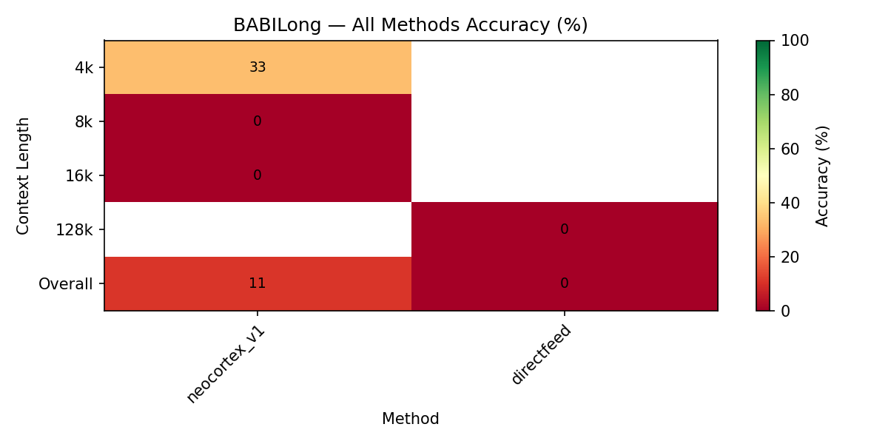

# TinyCortex Benchmarks

This directory contains the benchmark tooling that ships with the open-source
Rust crate, plus headline results from evaluations of the hosted TinyCortex
platform.

There are two distinct things here — please don't confuse them:

1. **[`effectiveness/`](./effectiveness/README.md)** — the reproducible,
   in-repo benchmark. A standalone Rust harness that measures retrieval
   quality (recall@k, precision@k, hit@k, MRR, nDCG@k) over labeled datasets.
2. **Hosted platform evaluations** (RAGAS, TemporalBench, BABILong,
   Vending-Bench, below) — results measured against the broader TinyCortex
   system (`tinycortex_v1`). The harness that produced them is **not included
   in this repository**, so these numbers are *reported*, not reproducible
   from this repo.

---

## Reproducible: retrieval-effectiveness harness

The only benchmark you can run from this repository today:

```bash
cd benchmarks/effectiveness
cargo run --bin effectiveness
# options: --dataset PATH   (default: data/fixtures_v1.json)
#          --out DIR        (default: results/)
#          --label LABEL    (default: $GIT_SHA or "local")
cargo test    # unit tests for the metrics + dataset validation
```

It path-depends on the `tinycortex` crate and exercises the lexical
`InMemoryMemoryStore` baseline over a hand-labeled seed corpus
(`data/fixtures_v1.json`, 10 documents / 12 queries). Output is a summary
table on stdout plus a dated JSON report under `results/` (gitignored, so
runs are diffable across commits without polluting history).

See [`effectiveness/README.md`](./effectiveness/README.md) for the dataset
format, metrics, how to add a backend, and the roadmap (engine-backed and
real-embedding modes are planned but not yet implemented).

---

## Reported: hosted platform evaluations

> **Not reproducible from this repo.** The results below were measured for
> TinyCortex Mark 1 (`tinycortex_v1` — GraphRAG with time-decay and
> interaction weighting) using an evaluation harness that is not part of this
> repository. The comparison methods (FastGraphRAG, Mem0, SuperMemory,
> gemini_vdb, e2graphrag, scratchpad, directfeed) are likewise not vendored
> here. Charts are pre-rendered. Treat these as system-level results for the
> hosted platform, which the open-source Rust core contributes to.

### RAGAS (Sherlock Holmes Corpus)

**What it measures:** Standard retrieval-augmented generation quality — answer correctness, faithfulness, answer relevancy, context precision, and context recall.

**Methodology:** 50 questions generated from the complete Sherlock Holmes corpus (4 types: inference, multi-hop, cross-story, analytical). Evaluated using [RAGAS 0.4.x](https://docs.ragas.io/) with GPT-4o as the judge model. Each method ingests the same chunked corpus, then answers all questions. RAGAS scores are computed per-question and aggregated.

**Methods compared:** tinycortex_v1, fastgraphrag, gemini_vdb, mem0, supermemory

<div align="center">

</div>

**Key results:**
| Metric | TinyCortex | Best Competitor | Competitor |
| ------ | --------- | --------------- | ---------- |
| Answer Relevancy | **0.97** | 0.88 | supermemory |
| Context Precision | **0.75** | 0.76 | supermemory |
| Faithfulness | 0.73 | **0.79** | gemini_vdb |
| Answer Correctness | 0.57 | **0.59** | gemini_vdb |
| Context Recall | 0.62 | **0.70** | gemini_vdb |

TinyCortex achieves the highest Answer Relevancy score by a significant margin (0.97 vs 0.88) and is competitive on Context Precision. The graph-based retrieval ensures that returned context is highly relevant to the query, even when the answer requires cross-story reasoning.

---

### TemporalBench

**What it measures:** Temporal reasoning accuracy — can the memory system correctly answer questions about event ordering, state at a specific time, recency, intervals, and sequences?

**Methodology:** Questions are categorized into 5 temporal reasoning types. Each method ingests time-stamped events and is evaluated on accuracy per question type.

**Methods compared:** tinycortex_v1, directfeed, e2graphrag, mem0, supermemory

<div align="center">

</div>

**Key results:**
| Question Type | TinyCortex | Best Competitor | Competitor |
| ------------- | --------- | --------------- | ---------- |
| Recency | **100%** | 80% | directfeed |
| Interval | 68% | **97%** | directfeed |
| Ordering | 60% | **80%** | directfeed |
| State at Time | 60% | **80%** | e2graphrag |
| Sequence | 30% | **80%** | directfeed |

TinyCortex achieves **perfect accuracy on recency questions** (100%), reflecting its time-decay ranking — recent memories score higher at query time. The directfeed method (feeding full context to the LLM) performs well on interval and sequence questions where having the complete timeline helps, but this approach doesn't scale beyond context window limits.

---

### BABILong (Needle in a Haystack)

**What it measures:** Whether a retrieval method can find specific facts ("needles") embedded within increasingly large contexts of distractor text.

**Methodology:** Facts are inserted at various positions within contexts of 4k, 8k, 16k, and 128k tokens. Methods must retrieve the correct fact to answer a question. Accuracy is measured per context length.

**Methods compared:** tinycortex_v1, directfeed

<div align="center">

</div>

**Key results:**
| Context Length | TinyCortex | directfeed |
| -------------- | --------- | ---------- |
| 4k | **33%** | 0% |
| 8k | 0% | 0% |
| 16k | 0% | 0% |
| 128k | 0% | 0% |
| **Overall** | **11%** | **0%** |

TinyCortex is the **only method that successfully retrieves needles**, scoring 33% at the 4k context length. While absolute accuracy is still low, this demonstrates the advantage of graph-based indexing over raw context window approaches — the knowledge graph can locate specific entities even when surrounded by large volumes of distractor text. Directfeed scores 0% across all context lengths.

---

### Vending-Bench (Agentic Decision-Making)

**What it measures:** How well a memory-augmented agent makes business decisions over time. An agent manages a simulated vending machine operation over 30 days, deciding what products to stock, where to place machines, and how to price items.

**Methodology:** Each method provides the agent's memory layer. The agent receives daily sales data and must make restocking and pricing decisions. Performance is measured by cumulative Profit & Loss (P&L) over 30 simulated days.

**Methods compared:** tinycortex_v1, mem0, scratchpad, supermemory

<div align="center">

</div>

**Key results:**
| Method | Final P&L (Day 30) |
| ------ | ------------------- |
| **tinycortex_v1** | **~$295** |
| scratchpad | ~$285 |
| supermemory | ~$215 |
| mem0 | ~$5 |

TinyCortex achieves the **highest cumulative P&L by day 30** (~$295). The interaction-weighted memory ensures the agent prioritizes learning from high-signal events (successful sales, pricing changes) while forgetting noise (random daily fluctuations). Mem0 barely breaks even, suggesting that without structured memory, the agent cannot learn from past decisions effectively.
